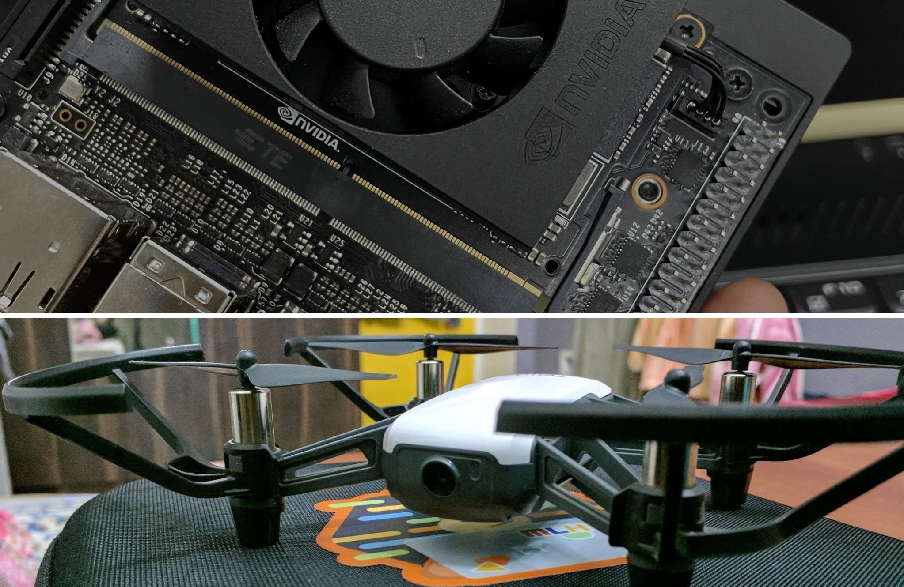

# SnotBot-Deepstream
### How about a time when a drone in your control can perform much ahead then a submarine out of your control can do ?
### Amazed ?? So was I ! 
Let's start with small example of plankton data, Planktons generate about half the atmosphere's oxygen, as much per year as all land plants. Phytoplankton also form the base of virtually every ocean food web and getting information about them is really tough, but SnotBot does it in a really different way.


Whales are majestic, so do their snot. There is a lot of microbials in the snot droplets. The microbial data consists of plethora of information (e.g. Algal Bloom, Whale's Health, Plankton Reserviour e.t.c). 
To make the collection of snot easier, SnotBot stealthily flies over the whale and collects the snot.

## The SnotBot consists of two modules
### Xavier NX and Tello 
Xavier NX helps in video analytics (to read the stream and detect the whales and snot) and Tello for for streaming the footage and collecting the sample.



## Deepstream Setup

Make sure that your Jetson device is fully setup, If not check [here](https://docs.nvidia.com/jetson/jetpack/install-jetpack/index.html).

### 1. Install System Dependencies

```bash
sudo apt install \
libssl1.0.0 \
libgstreamer1.0-0 \
gstreamer1.0-tools \
gstreamer1.0-plugins-good \
gstreamer1.0-plugins-bad \
gstreamer1.0-plugins-ugly \
gstreamer1.0-libav \
libgstrtspserver-1.0-0 \
libjansson4=2.11-1
```

### 2. Install Deepstream

Download the DeepStream 5.0.1 Jetson Debian package `deepstream-5.0_5.0.1-1_arm64.deb`, to the Jetson device from [here](https://developer.nvidia.com/assets/Deepstream/5.0/ga/secure/deepstream_sdk_5.0.1_amd64.deb). Then enter the command:

```bash
sudo apt-get install ./deepstream-5.0_5.0.1-1_arm64.deb
```
### *Gstreamer python bindings are already installed in the Jetson devices. If not, install python bindings using the following commands
```bash
sudo apt-get install python-gi-dev
export GST_LIBS="-lgstreamer-1.0 -lgobject-2.0 -lglib-2.0"
export GST_CFLAGS="-pthread -I/usr/include/gstreamer-1.0 -I/usr/include/glib-2.0 -I/usr/lib/x86_64-linux-gnu/glib-2.0/include"
git clone https://github.com/GStreamer/gst-python.git
cd gst-python
git checkout 1a8f48a
./autogen.sh PYTHON=python3
./configure PYTHON=python3
make
sudo make install
```


## Tello Setup 
The dependencies needed are the following:

Install these packages using pip
```sh
djitellopy==1.5
evdev==1.3.0
imutils==0.5.3
numpy==1.19.4
opencv-python==4.4.0.46
pycairo==1.20.0
pygame==2.0.1
PyGObject==3.38.0
pynput==1.7.2
python-xlib==0.29
redis==3.5.3
six==1.15.0
```
```sh
apt install redis-server
```
Connect Jetson device to Tello's wifi

```sh
python3 tello-control.py
```
the rtsp feed of tello will be streaming on

```sh
rtsp://127.0.0.1:7878/snotbot
```

## Running the code 

```sh
cd nvdsinfer_custom_impl_Yolo/
make clean && make
python3 snotbot.py <path of the video source>
```
## Citations

* [AlexeyAB/darknet](https://github.com/AlexeyAB/darknet)
* [aj-ames/Hermes-Deepstream](https://github.com/aj-ames/Hermes-Deepstream)
* [damiafuentes/DJITelloPy](https://github.com/damiafuentes/DJITelloPy)
* A Crocodile and A Whale
